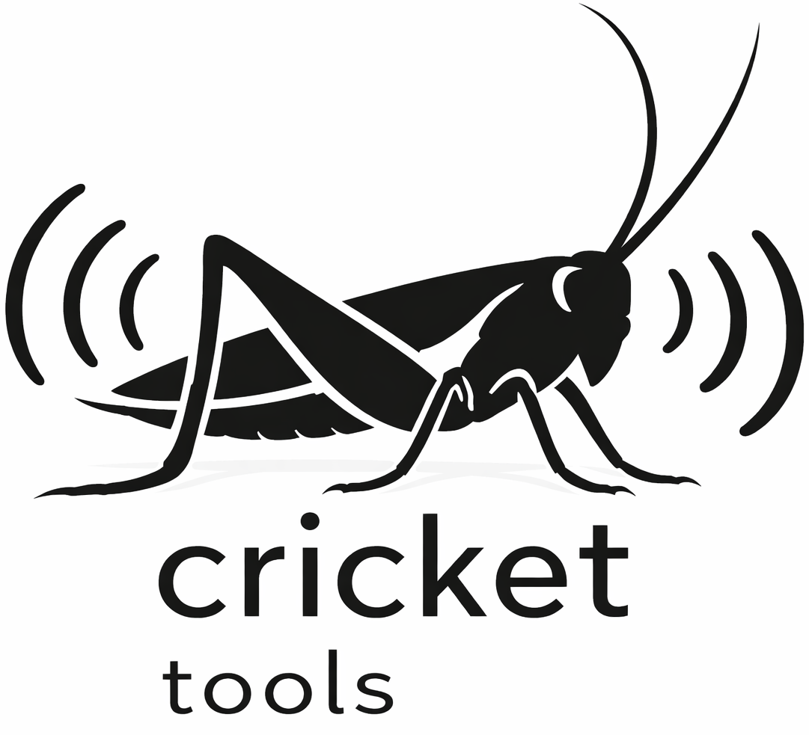

# Cricket Tools



Cricket Tools is a real-time, multi-user web app for audio scoring on mobile devices. A Conductor controls parameters for multiple Players. Players see a personalized visual score and hear synchronized audio.

## Features
- Two tools:
  - **Live Play** (real-time synth scoring)
  - **MP3 Sync** (synchronized playback)
- Two roles per tool:
  - **Conductor**
  - **Player**
- Real-time updates via **Socket.IO**, including basic clock sync for aligned playback
- Audio synthesis and timing using **Tone.js**
- Optional external control via **OSC over UDP** and a **Node for Max** script

## How does it work?
Players connect from phones/tablets/laptops and join as **Player**.
A Conductor joins as **Conductor** and changes parameters in real time.
The server maintains in-memory state and broadcasts updates to connected clients.

## Tech stack
Frontend: React + Vite + Tailwind
Backend: Express + Socket.IO
Audio: Tone.js
Optional: OSC control (UDP)

## Getting started (local)
1. Install Node.js (Node 20+ recommended)
2. In the project folder, install dependencies:
    ```bash
    npm install
    ```
3. Start the dev server:
    ```bash
    npm run dev
    ```
4. Open:
    - `http://localhost:5001`
    - Or from another device on the same Wi‑Fi/LAN: `http://<your-ip>:5001`

  ```

## Usage
### Live Play (real-time synth score)
1. Open the app and join as **Conductor** on one device.
2. Join as **Player** on one or more other devices.
3. Use the Conductor UI to change parameters (e.g. pitch/interval). Players update immediately.

### MP3 Sync (synchronized playback)
MP3 Sync is slot-based (default `MAX_SLOTS = 8`). Each connected MP3 player gets assigned the lowest available slot.

## External control
### OSC (UDP)
The server listens for OSC over UDP at `127.0.0.1:9000`.

Message format:
```text
/conductor <target> <control> <value>
```

- `target` (int):
  - `1..N`: specific player number (stable numeric ID assigned by the server)
  - `-1`: all players
  - `0`: global (reserved for scene selection)
- `control` (int, for the `audioScore` scene):
  - `1`: pitch (36–84 MIDI)
  - `2`: interval (50–3000 ms)
  - `100`: scene (global only; uses a numeric index)
- `value` (number)

Examples:
```text
/conductor 3 1 72
/conductor -1 2 1200
/conductor 0 100 0
```

### Node for Max (Socket.IO)
Use `public/conductor-control.js` to control the Conductor from Max via Node for Max.

1. Copy `public/conductor-control.js` into your Max project folder
2. In that folder run: `npm install socket.io-client`
3. In Max create: `[node.script conductor-control.js]`

## Configuration
- HTTP server port:
  - Default: `5001`
  - Override with `PORT`
- HTTP server host:
  - Default: `0.0.0.0`
  - Override with `HOST`
- OSC:
  - Fixed at `127.0.0.1:9000`
- Uploads directory:
  - `./uploads`

## License
Apache License 2.0